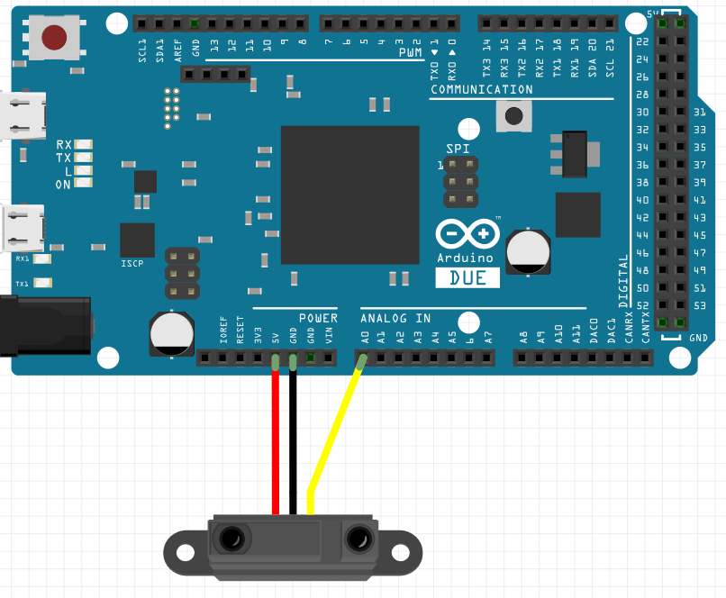
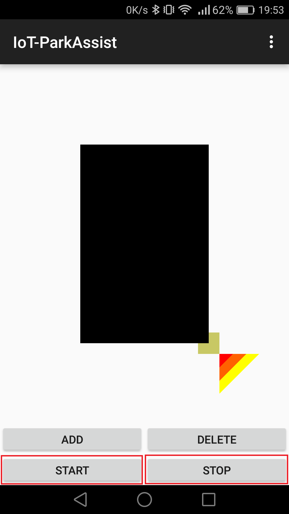
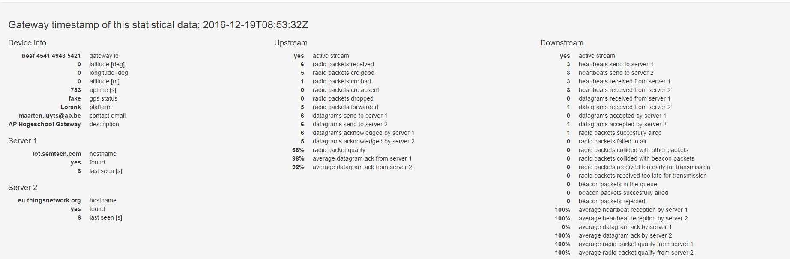

#Inbraakdetectiesysteem

In deze handleiding vindt u alle informatie terug die nodig is om zelf dit project te maken. Het project bestaat uit een module die in de caravan komt te staan en een gateway die ervoor zorgt dat de verzonden data naar de applicatie geraakt.

##Inhoudsopgave

* [Hardware](#hardware)
* [Module Hardware](#module-hardware)
  * [LoRa Mote verbinden met Arduino](#lora-mote-verbinden-met-arduino)
  * [Arduino verbinden met Bluetooth module](#arduino-verbinden-met-bluetooth-module)
  * [IR sensor verbinden met Arduino](#ir-sensor-verbinden-met-arduino)
* [Module software](#module-software)
  * [The Things Network](#the-things-network)
    * [Waarom TTN?](#waarom-ttn)
    * [Applicatie registreren](#applicatie-registreren)
    * [Device registreren](#device-registreren)
   * [Arduino code](#arduino-code)
   * [Application code](#application-code)
     * [Applicatie installeren](#applicatie-installeren)
     * [Werking applicatie](#werking-applicatie)
* [LoRa Gateway](#lora-gateway)

* [Testing](#testing)
  * [Verbinden met RN2483](#verbinden-met-rn2483)
  * [RN2483 configureren](#rn2483-configureren)
  * [TTN joinen](#ttn-joinen)
  * [Data verzenden](#data-verzenden)
  * [Data ontvangen](#data-ontvangen)

##Hardware

- [LoRa Gateway](http://webshop.ideetron.nl/LORANK-8)

- [LoRa Mote](http://www.microchip.com/DevelopmentTools/ProductDetails.aspx?PartNO=dm164138)

- [IR Distance Sensor](http://qqtrading.com.my/infrared-proximity-sensor-4cm-30cm-sharp-gp0a41sk)

- [Arduino DUE](https://www.arduino.cc/en/Main/arduinoBoardDue)

- [Bluetooth module HC05](http://www.martyncurrey.com/hc-05-fc-114-and-hc-06-fc-114-first-look/)


Datasheets etc. zijn te vinden op de link van ieder device.


##Module Hardware

###LoRa Mote verbinden met Arduino

Verbind de Mote op de volgende manier met de Arduino DUE:


Indien je de LoRa Mote gebruikt, zorg er dan altijd voor dat de antenne verbonden is met het board voor je er stroom opzet. Indien je dit niet doet, kan dit ernstige schade toebrengen.


###Arduino verbinden met Bluetooth module

Verbind de Arduino DUE op de volgende manier met de Bluetooth module:


De RX van de bluetooth module kan maar 3,3V aan, waardoor er normaal een spanningsdeler wordt gebruikt tussen de TX van de arduino en de RX van de bluetooth module. Zoals te zien is op de foto is deze spanningsdeler niet aanwezig, aangezien de Arduino Due standaard op 3,3V werkt.


###IR sensor verbinden met Arduino

Verbind de IR sensor op de volgende manier met de Arduino DUE:





##Module software

###The Things Network

####Waarom TTN?


The Things Network is een netwerk dat Crowd Sourced IOT van vrij gebruik voorziet. Met andere woorden staat dit netwerk ons to om ons project te realiseren en later misschien zelfs in productie te brengen.


Naast TTN zijn er nog andere opties, maar deze zijn minder geschik voor ons project:


- Semtech is een bedrijf dat een router host dat alle gateways mogen gebruiken voor demonstratie doeleinden. Semtech stelt dus enkel hun services vrij voor demonstraties, wat betekent dat het maar een tijdelijke oplossing zou zijn indien we het project ook in productie willen brengen.


- Loraley is een alternatief open source data netwerk dat nog in primitieve staat is en dus nog niet aan te raden is als betrouwbaar netwerk. Het is dus nog niet Up & Running naar behoren.


####Applicatie registreren


Voor we data met de LoRa Mote kunnen verzenden, moeten we op TTN een applicatie toevoegen. Deze applicatie zal de nodige info bevatten om ervoor te zorgen dat we met onze android applicatie de verzonden data kunnen ophalen.


Ga naar de volgende site van TTN (https://v1.account.thethingsnetwork.org/users/login) en maak hier een account aan. Eenmaal je ingelogd bent, ga je naar je dashboard. Op je dashboard klik je op "create application", waarna je je applicatie een naam geeft. Nu je je applicatie toegevoegd hebt, kan je alle informatie terugvinden die je nodig hebt om data verzonden naar deze applicatie te verkrijgen. Deze informatie krijg je door op "learn how to get data from this app" in het deel "application info" te klikken.


####Device registreren

Nu je een application hebt geregistreerd, kan je devices aan deze applicatie toewijzen. Deze devices zijn de nodes waarmee we data naar het netwerk verzenden. In ons geval willen we de LoRa Mote registreren.


Een nieuw device registreren doen we door bij devices op het vraagteken te klikken, waarna we "register device" selecteren.


Wanneer we een device willen registreren kunnen we kiezen uit twee manieren van activatie, namelijk ABP en OTAA.


######Activation By Personalization (ABP)

In sommige gevallen is het een noodzaak om security keys en Device Address te hardcoden op het device. Met deze strategie hou je het systeem simpeler, omdat het gehele join process dan niet meer nodig is. Het geeft dan wel mogelijk een security-risico.


######Over The Air Activation (OTAA)

Vaakst voorkomende en meest veilige manier om met The Things Network te verbinden. Devices zullen hierbij eerst een join-procedure met het netwerk uitvoeren. Tijdens deze procedure zullen de devices een dynamisch Device Address krijgen en zullen de security keys worden onderhandeld.


Omdat het voor ons als nieuwe gebruikers eenvoudiger was om via ABP te verbinden, hebben wij voor deze optie gekozen. Indien je toch gebruik wilt maken van OTAA kan dit en dit is ook ondersteunt in de door ons gebruikte code (dit staat uiteraard wel in comments).


Indien je ABP hebt gekozen, kan je gewoon op "Register" klikken, aangezien de "App session key" en de "Network session key" random gegenereerd worden. Nu is je device geregistreerd en klaar om gebruikt te worden.


Indien je naar de pagina van je device gaat, zal je zien dat je hier alle informatie vindt die je nodig hebt om met je device connectie te maken met TTN. Op deze pagina kan je ook alle  data zien die je met je device naar TTN hebt verzonden.


###Arduino code

De code die we op de Arduino zetten is [hier](https://github.com/AP-Elektronica-ICT/iot16-park-assist/blob/Lora/src/Arduino/LoRa_volledig_werkend/LoRa_volledig_werkend.ino) te verkrijgen. Deze code zal automatisch blijven proberen te verbinden met TTN en indien dit gelukt is, zal het wachten op data die hij binnenkrijgt via de bluetooth module. Deze data zal via de android applicatie verzonden worden.


Indien de code een "Y" binnenkrijgt, zal het de IR sensor een afstand laten uitlezen, wat onze referentie afstand zal zijn. Vanaf dit moment zal er gedetecteerd worden wanneer de afstand veranderd, waarna er  een bericht via de LoRa Mote verzonden zal worden naar TTN.


Indien de code een "N" binnenkrijgt, zal het het uitlezen van de afstand stoppen en zullen er geen berichten meer via de LoRa Mote verzonden worden.


In de code zal je in het volgende stukje je device gegevens moeten ingeven aan de hand van welke activatie manier je hebt gekozen.


```

//ABP: initABP(String addr, String AppSKey, String NwkSKey);

join_result = myLora.initABP("9CC4931F", "F6A0912BC9B5CC12075D87D9A0553C89", "82E46DC9ABE0730FA1694B91677E37C0");

  

//OTAA: initOTAA(String AppEUI, String AppKey);

//join_result = myLora.initOTAA("70B3D57ED00001A6", "A23C96EE13804963F8C2BD6285448198");

```


###Application code

De code voor de applicatie die we in dit project gebruiken is [hier](http://) te vinden. Aangezien in deze applicatie ook de code zit voor de parkeersensors, is het van belang dat je enkel de bluetooth module van dit project aan je smartphone gekoppeld hebt en niets anders.

Deze applicatie zal verbinden met de MQTT server van TTN en zich registreren op het topic van ons gebruikte device. Indien je dit voor je eigen device wilt doen, moet je de volgende lijnen in de code aanpassen met de gegevens van je eigen geregistreerde applicatie en device op TTN. Deze code is terug te vinden in [mqttClass.java](http://).


```

client = new MqttAndroidClient(classContext, "tcp://staging.thethingsnetwork.org:1883", clientId);


options.setUserName("70B3D57ED00018A3");

options.setPassword("nrmLIdzcRc+zQTpiWO7QGvwCCJtN7Kw0F5how6WjBbY=".toCharArray());


String topic = "70B3D57ED00018A3/devices/000000009CC4931F/up";

```
####Applicatie installeren
Voor we de applicatie kunnen gebruiken, zullen we deze eerst op de smartphone moeten zetten. Om dit te doen, verbinden we de smartphone met de laptop en openen we de applicatie in "Android Studio". In Android studio klik je op run in het menu, waarna je je smartphone selecteert en op "OK" klikt.


Na een tijdje zal er op je scherm gevraagd worden of je de applicatie wilt installeren, selecteer hier "installeren". Nu wordt de applicatie geïnstalleerd, waarna deze klaar is om te gebruiken.

####Werking applicatie

Nu alles klaar is voor gebruik, hoef je enkel nog maar je bluetooth te koppelen met de bluetooth module van de Arduino. Het is van belang dat dit het enigste gekoppelde device op je smartphone is.

Om het alarm aan te zetten, moet je nu enkel op start klikken om "Y" naar de Arduino te sturen, wat het alarm zal aanzetten. Indien je op stop klikt, zal er "N" naar de Arduino gezonden worden, wat het alarm zal afzetten.



Indien de module data naar de MQTT server stuurt, zal de applicatie dit zien en een notificatie aan de gebruiker geven als waarschuwing dat er iemand het alarm heeft doen afgaan.


##LoRa Gateway

###Hoe beginnen we eraan?

Voor de gateway aan de praat te krijgen, hebben we een voedingsbron nodig. Deze kan men via een USB-kabel verbinden met een laptop en hiermee via poweren. Voorts hebben we ook een Ethernet kabel nodig om de LoRa Gateway van internet te voorzien. De Ethernet kabel hebben we dan ook aan de laptop gehongen en dan via DHCP gaven we de LoRa Gateway internet. 


Voor te beginnen maakten we ook gebruik van de Manual en installation guide van ideetron. Deze zijn ook te vinden in de documentatie onder de map ExtraToevoeging.


###Praten met de LoRa Gateway

We kunnen via de seriële connectie met Putty op de gateway geraken.

Aangezien het de eerste keer was dat de gateway werd gebruikt, zijn de default inloggegevens nog geldig.

Deze kan men ook vinden in de Installation Guide van de LoRa Gateway. Deze default gegevens zijn nog momenteel nog in gebruik. (Login: root; pwd: LorankAdmin)

De Gateway forward als default het Poly pakket. Deze pakketjes worden gebruikt in The Things Network. Tevens ook het netwerk dat wij als verzendmogelijkheid zien voor onze toepassing.

Omdat het ook de eerste keer is dat men de gateway gebruikt, was het ook nodig om de certificaten te installeren.

> Dit ging via het commando: apt-get install ca-certificates.


Eens dit gebeurt was, konden we verder gaan met het proces.


###Verbinding met het internet

Eens de installatie voorbij was, konden we verder aan de slag met de gateway.

Vanaf dit punt maakten we ook gebruik van de Manual van Ideetron.

Beide de USB-kabel en de Ethernet-kabel waren verbonden, en de lampjes van de gateway branden, dus konden we verder aan de slag.

Als eerste moesten we ontdekken op welk IP-adres we de gateway konden bereiken.

> Met het alomgekende ifconfig kwamen we hier makkelijk achter.


In het netwerkcentrum zetten we een netwerkbrug op; een brug tussen Ethernet & de Wifi-module van de laptop.

Zo konden we een IP-adres geven aan de LoRa Gateway en kon deze naar de buitenwereld toe zichtbaar worden.


Voorts gingen we naar onze favoriete browser, Google Chrome en typten we dat IP-adres in.

Als we surften naar dat adres kwamen we terecht op het adminscherm van de gateway.

Hierop was te zien met welke server hij verbonden was, hoeveel pakketjes er al op werden verstuurd...

Er was een tabel te zien met Upstream-data en een tabel met Downstream-data.


Verder kon men ook instellen welke soort pakketjes men wou ontvangen en versturen via de gateway.

Men kon kiezen voor de Poly Packets van TTN, die van Semtech of Loraley


###Connectie met het TTN netwerk

Om connectie te kunnen maken met de servers van het TTN netwerk, moesten we wat aanpassen in de configuratie van de module.

We moesten in de local_conf.json file een aanpassing maken.

> cd lorank8-0.2.3


> cd packet_forwarder


> cd poly_pkt_fwd


> nano local_conf.json


In deze json file voegen we het volgende toe:


	"servers":[{

    		"server_address : "<eu.thingsnetwork.org>",

            "serv_port_up":1700,

            "serv_port_down":1700,

            "serv_enabled":true

    }]


Et voilà!


De gateway heeft connectie met de servers, zendt en ontvangt ook heartbeats van de servers!

De connectie tussen gateway en servers wordt ook om de +-2 min. getest.

+

Men kan ook in real time de quality van de datastreams zien.





###Packets ontvangen & verzenden

Als men pakketjes verstuurd via de LoRa Mote, dan is dit ook zichtbaar op het dashboard van de gateway.

Bij de tabel Upstream krijgen we radio packets aan; ook wordt er een onderscheid gemaakt tussen pakketjes die goed of slecht worden ontvangen. Degene die goed werden ontvangen, zullen verder worden verzonden naar de server.

Deze pakketjes worden dan als datagrams verstuurd naar de server( men krijgt ook een acknowledgement van de TTN server als dit gebeurd).


In de downstream tabel kan men zien of de datagrams ontvangen werden door de server, alsook of de radio packets succesvol over het netwerk zijn gestuurd.


###Logging


Het dashboard van de LoRa Gateway is opzich al een handige tool om te kunnen bekijken wat er door de gateway komt. Maar natuurlijk zijn de logs daar ook een heel handig gegeven voor.

Om deze te kunnen bekijken gebruik je dit commando:

> tail -f /var/log/syslog


Bij een werkend systeem zie je dan ongeveer zo een logs.


Tussen deze logs kan je zien hoeveel packets ontvangen zijn, percentage geslaagde/gefailde zendingen, forwarded packets.

Alsook wat er downstream gebeurd, gps tracking (indien dit ingesteld is) en de performance van de connectie.


##Testing

Indien je de LoRa Mote wilt uittesten zonder gebruik te maken van de Arduino en de applicatie, kan je dit op volgende manier doen. We gaan bij deze stappen er wel van uit dat de Gateway aanstaat en verbonden is met TTN.


###Verbinden met RN2483

Indien je rechtstreeks verbinding wilt maken met de RN2483 Transceiver module die zich op het board bevind, zal je je laptop via een USB to Micro-USB kabel moeten verbinden met de LoRa Mote.


Nadat dit is gebeurt, zal de LoRa Mote opstarten, waarna we Serieel verbinding kunnen maken. Dit doen we door een programma met de naam "termite 3.2" te gebruiken, aangezien "Putty" hier niet zal werken. Op termite zal je de volgende instellingen moeten aanpassen:


- Baud rate: 57600

- Parity: none

- local echo: on

- data bits: 8

- stop bits: 1

- flow control: none

- append CR+LF: on


Eenmaal dit alles gedaan is, kunnen we verbinding maken met de RN2483 Transceiver module. De verschillende commando's die hier gebruikt kunnen worden, zijn [hier](http://ww1.microchip.com/downloads/en/DeviceDoc/40001784B.pdf) terug te vinden.


Door gebruik te maken van deze commando's is het mogelijk om data te verzenden etc...


###RN2483 configureren

Voor we TTN kunnen joinen zullen we eerst de nodige gegevens moeten instellen. In het geval van ABP activatie, zoals we in dit project gebruiken, moeten we het "device address", "network session key" en "application session key" instellen, wat we met de volgende commando's doen:

- mac set devaddr [address]

- mac set nwkskey [network session key]

- mac set appskey [application session key]


Bij deze commando's is het element tussen de vierkante haken hetgeen dat vervangen moet worden door de relevante data.


###TTN joinen

Nu alles ingesteld is, kunnen we verbinding maken met TTN en dat doen we met het volgende commando:

- mac join [mode]


Mode staat hier voor de activatiemethode, met andere woorden zal je mode moeten vervangen door oftewel "abp" oftewel "otaa". Aangezien we alles geconfigureerd hebben voor abp kiezen we ook voor deze methode.


###Data verzenden

Nu we verbonden zijn met TTN kunnen we data verzenden door gebruik te maken van het volgende commando:

- mac tx [type] [port number] [data]


Type stelt het uplink payload type voor en kan "cnf" of "uncnf" zijn, wat respectievelijk voor confirmed en unconfirmed staat.


Port number is een decimaal nummer dat het poortnummer voorstelt en is een nummer van 1 tot 223. Kies hier om te testen gewoon een nummer die aan de vereisten voldoet.


Data is gelijk aan de data die je wilt verzenden en moet in hexadecimale vorm zijn.


###Data ontvangen

Nu we data naar TTN hebben verzonden, kunnen we deze ook ontvangen door onszelf te subscriben op ons device op de TTN MQTT server.


Dit kunnen we doen door gebruik te maken van "Mosquitto". Om Mosquitto te gebruiken heb je een Linux device nodig of moet je gebruik maken van Bash voor Windows. Om mosquitto te installeren, runnen we het volgende commando:

- apt-get install mosquitto mosquitto-clients


Om te subscriben gebruik je dit commando:

- mosquitto_sub -h [broker] -t [topic] -u [username] -P [wachtwoord]


De te vervangen data is te vinden op je TTN dashboard wanneer je bij je Application info" op "learn how to get data from this app" klikt.


Meer info over hoe je met de TTN MQTT server moet verbinden is [hier](https://www.thethingsnetwork.org/docs/applications/mqtt-v1/api.html) te vinden.


