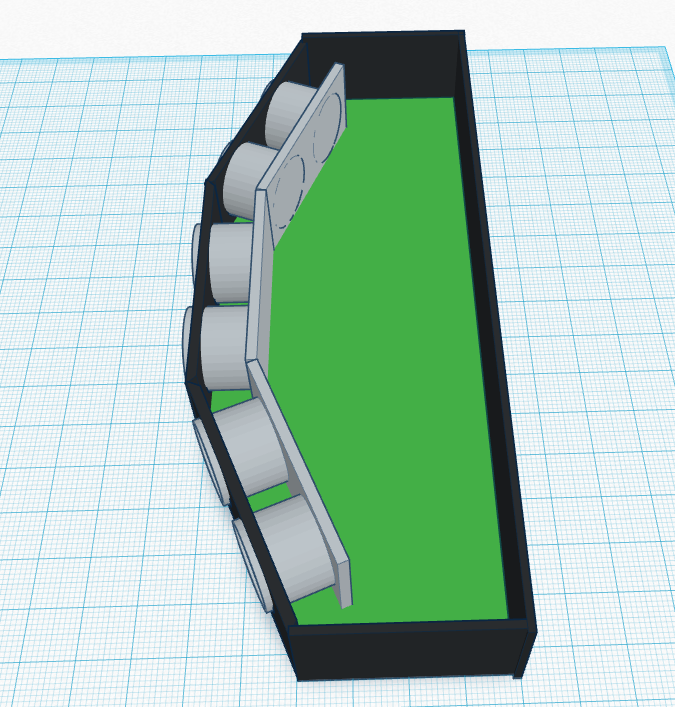

#Projectplan Park Assist

##Team
- Mathias Samyn (mathiassamyn)
- Joey Driessen (xigolle)
- Marijn Joosens (MJoosens)

##Project keuze

Onze project keuze is gevallen voor *Park Assist* omdat dit ons wel een zeer interessant project leek.
Met dit project gaan we een bestaand product op een andere manier realiseren. Uiteraard bestaan er al park assist producten op de markt, maar nog geen die afneembaar zijn. Dit stelt het mogelijk om het op je auto te gebruiken of op je caravan wanneer nodig. Tevens vinden wij het interessant om IoT te verbinden met de mobiele telefoon om zo een goede ervaring voor de gebruiker te realiseren.
##Projectbeschrijving
Wij hebben gekozen voor park assist van Mr. Overdulve. Er wordt van ons verwacht om een assisteersysteem te maken om caravans, opleggers of auto’s zonder sensors te voorzien van parkeersensoren.
Aangezien men op caravans geen parkeersensoren plaatst vanuit de fabrikant zelf, komt het regelmatig voor dat men de caravan beschadigt tijdens het inparkeren op de camping/stalling. Men heeft heel beperkt zicht naar achteren toe en ook al zeker als men om een bochtje moet inparkeren. Dit zorgt voor frustraties bij vele en ook voorkombare kosten.
Maar niet enkel caravans hebben dit probleem, hedendaags heeft niet elke auto parkeersensoren. Met dit systeem zouden we dus niet enkel reizigers met een sleurhut uit de nood kunnen helpen, maar ook mensen met een oudere auto. Zo hoeft men niet noodzakelijk een nieuwe auto aan te kopen voor toch die sensoren te hebben uit voorzorg. Ons systeem zal dus niet enkel mensen redden van een aanzienlijke kost, het zal ook het inparkeren voor mensen met verminderd zicht kunnen assisteren.
Zo zou ons systeem ook kunnen dienen als een oplossing voor het dode hoek-probleem bij grote camions/opleggers. Het komt wel vaker op het nieuws dat er weer een dode hoek-ongeval is gebeurd met jonge kinderen/verwarde fietsers.
Omdat de bestuurders van deze grote voertuigen vaak beperkt zicht hebben naar buiten toe, en meer bepaald naar de ‘dode hoek’ omdat ze op een hoogte zitten. Zo zouden onze sensoren dus mensen kunnen detecteren die zich naast de vrachtwagen bevinden en zo heel wat ongevallen kunnen voorkomen.

Wij gaan dit probleem oplossen door afneembare modules te maken met telkens 3 sensoren. Iedere sensor heeft een optimale leeshoek van 30°, om dus een volledige hoek te kunnen dekken, maken we gebruik van 3 sensoren. Zo creëren we een hoek van 90° om zo optimaal objecten te kunnen detecteren. De sensoren hebben een bereik vanaf minimaal 3 cm tot ongeveer een maximum van 400cm. Op deze manier hebben we een groot genoeg “kijkvlak” om alles te detecteren en kunnen we meldingen geven aan de hand van vooraf bepaalde afstanden. Deze meldingen zouden we sturen naar een mobiele app die via bluetooth met deze modules kan verbinden om zo het park assist-systeem te vervolledigen.

Het idee is om modules te creëren om op de hoeken te plaatsen. Per module maken we gebruik van 3 ultrasone sensoren, een arduino voor het verwerken van de informatie en het berekenen van de afstanden, en een bluetoothmodule waarmee men kan verbinden met de mobiele app.
Een idee kan zijn om vanaf 1.5m een onderbroken pieptoon te geven, vanaf 50cm een onderbroken pieptoon met een snellere frequentie en vanaf 30cm een durende pieptoon om aan te geven dat men zeer dicht tot een bepaald object zit.

Maar niet enkel caravans hebben dit probleem, hedendaags heeft niet elke auto parkeersensoren. Met dit systeem zouden we dus niet enkel reizigers met een sleurhut uit de nood kunnen helpen, maar ook mensen met een oudere auto. Zo hoeft men niet noodzakelijk een nieuwe auto aan te kopen om toch die sensoren te hebben uit voorzorg. Ons systeem zal dus niet enkel mensen redden van een aanzienlijke kost, het zal ook het inparkeren voor mensen met verminderd zicht kunnen vergemakkelijken. Zo zou ons systeem ook kunnen dienen als een oplossing voor het dode hoek-probleem bij grote vrachtwagens/opleggers. Het komt wel vaker op het nieuws voor dat er weer een dode hoek-ongeval is gebeurd met jonge kinderen/verwarde fietsers. Dit komt door het feit dat de bestuurders van deze grote voertuigen vaak beperkt zicht hebben naar buiten toe, en meer bepaald naar de ‘dode hoek’ omdat ze op een hoogte zitten. Zo zouden onze sensoren dus mensen kunnen detecteren die zich naast de vrachtwagen bevinden en het zou zo heel wat ongevallen kunnen voorkomen.

##Product omschrijving
Zoals gezegd in de projectbeschrijving, gaan we als project voor het vak "Internet of Things", een parkeersensor ontwikkelen die men overal op bv. een caravan kan plaatsen. Op deze manier kunnen we voertuigen en aanhangwagens toch voozien van parkeersensoren, terwijl ze daar eerder geen mogelijkheid tot hadden.

De gebruiker kan het product in modules aankopen, waarbij iedere module bestaat uit drie interne sensoren. Iedere module is een op zichzelf staande parkeersensor, waarbij de drie sensoren gezamelijk een hoek van 90° controleren (30° per sensor om een maximale dekking te waarborgen). De drie sensoren zullen één per één hun metingen doen om zo elkaars signaal niet te storen of te registreren.

De verschillende modules zullen elk apart communiceren met de mobiele applicatie, waarbij de gebruiker de afstand (doorgegeven door de modules) kan aflezen. In deze applicatie kan de gerbuiker vrij modules toevoegen (indien ze verbonden zijn met de smartphone) of verwijderen. Het toevoegen van de sensoren kan de gebruiker doen door in de applicatie aan te geven waar hij de module op het voertuig geplaatst heeft.

Voor dit project achten wij om 2 modules te ontwikkelen (6 sensoren in totaal, 3 per module) om deze uiteindelijk te kunnen testen op een voertuig/aanhangwagen.

Om het wat duidelijker weer te geven hebben we een paar images die iets meer duidelijkheid geven.
Hieronder is te zien hoe de parkeer assist module eruit ziet. Zoals je kan zien zitten er 3 sensoren per module.

Vooraanzicht:

Bovenaanzicht (met cover geopend):

Hieronder is te zien hoe dit bijvoorbeeld op een caravan eruit zou zien:

###Uitbreidingen
Volgens de specificaties van het project moeten we enkel zorgen voor een module (bestaande uit 3 sensoren) die communiceert met de mobiele applicatie. De mobiele applicatie zal op zijn beurt aangeven hoe ver de sensoren verwijderd zijn van een object. Echter zijn er natuurlijk veel meer aspecten aan dit project waar wij (indien er tijd over is) nog aan willen gaan werken.

Zo zullen we een case gaan designen met een mechanisme om er voor te zorgen dat we dit op elke auto/aanhangwagen kunnen bevestigen. Uiteraard niet enkel vastmaken maar ook het kunnen verwijderen en hergebruiken is belangrijk. 

Als extra elektronica/functionele uitbreiding willen we gaan werken met een accelerometer. Dit stelt ons in staat om te detecteren wanneer het voertuig in beweging is of niet. Indien het voertuig niet in beweging is, is het niet nodig dat de sensoren metingen uitvoeren, aangezien het voeruig niet dichter naar een object gaat. Ook indien het voertuig te hard rijdt, wat niet zou voorkomen bij het inparkeren, heeft het geen nut om de sensoren te laten aanstaan. Indien we in beide gevallen de sensoren uitzetten, zou dit stroom besparen, wat de batterij ten goede zou komen.

##Functionele analyse

###High level blokdiagrammen

###Flowcharts software

###Bruikbare technologieën

####Software
- **Android** Wordt gebruikt voor het ontwikkelen van de mobiele applicatie die de waardes van de gemeten sensoren grafisch laat zien en voor het instellen van de sensoren.
- **Bluetooth** Wordt gebruikt voor het versturen van de sensor data van de Arduino naar de mobiele applicatie.
- **C++ (Arduino)** Wordt gebruikt voor het programmeren van de Arduino voor bijvoorbeeld het aansturen van de sensoren en Bluetooth module.

####Hardware

- **1X Bluetooth module (HC-05)** Wordt gebruikt voor het verzenden van data van de Arduino naar de mobiele applicatie.
- **3X Ultra Sonic range measurement module (M: SEN136B5B)** Wordt gebruikt voor het meten van de afstand tot naderende objecten.
- **1X Arduino NANO (ATMEGA328P-PU)** Wordt gebruikt voor al de logica voor het aansturen van de sensoren.
- **1X Android phone** Wordt gebruikt voor het developpen en testen van de mobiele applicatie.
- **1X Accelerometer (MMA8452)** (extra) Wordt gebruikt om na te gaan of het voertuig beweegt en of het te snel beweegt.
- **1X Sparkfun level converter** (extra) Wordt gebruikt om de 5V spanning die de Arduino naar de accelerometer stuurt om te zetten naar 3V.

###Project Planning
Voor het plannen en managen van het project maken we gebruik van Agile development via Github zelf.
Ons project kan gevolgd worden op de volgende link:
[Github project link park-assist](https://github.com/AP-Elektronica-ICT/iot16-park-assist/projects/1)

###Backlog
- [ ] **As a developer I need to prototype with the Arduino platform to work with the sensors**
Om de sensoren te testen gaan we eerst werken met het bestaand Arduino platform voordat we zelf een PCB ontwikkelen op basis van het Arduino platform.
- [ ] **As a developer I need to make sure the sensors work together in a 90 degrees cone**
We zullen de sensoren in bepaalde hoeken moeten plaatsen zodat we een dekking hebben van 90 graden.
- [ ] **As a developer I need a PCB design to start developing with the Arduino**
We moeten een PCB design maken om uiteindelijk te kunnen werken met ons eigen Arduino platform
- [ ] **As a developer I need a Multisim design to start developing the PCB**
Om het PCB design te maken moeten we eerst een Multisim schema maken.
- [ ] **As a developer I need to send data from the PCB to the Mobile App**
Al de data van de sensoren moeten verstuurd worden naar de mobiele app zodat deze kunnen worden verwerkt
- [ ] **As a user I need a mobile application to show where the parking sensors are**
De gebruiker moet visueel kunnen zien waar de parkeer sensoren zijn geplaatst
- [ ] **As a user I want to choose where I put my parking sensor in the mobile app**
De gebruiker moet kunnen aangeven waar de parkeer sensoren geplaatst worden.
- [ ] **As a user I want to see the distance from the car to the object aprouching in the mobile app**
De gebruiker moet visuele feedback krijgen van de parkeer sensoren wanneer het een object nadert.
- [ ] **As a user I want to hear a sound telling me that I am nearing a solid object**
De gebruiker moet feedback krijgen via geluid wanneer het een object nadert.
- [ ] **As a user I want a simple interface to show the distance from the parking sensor**
De gebruiker moet op een makkelijke manier kunnen zien hoe ver hij verwijderd is van een object
- [ ] **As a user I want to use Bluetooth to connect to my parking sensor**
De gebruiker gebruikt Bluetooth om te verbinden met de Parking sensor

