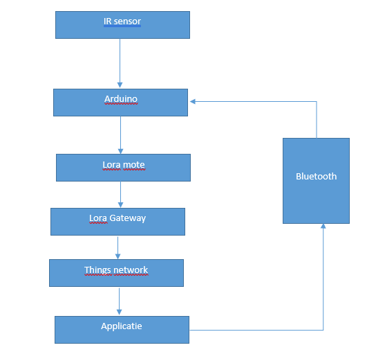

# Anti-inbraaksysteem
In dit document kunt u alles lezen over hoe het inbraaksysteem in zijn werking gaat.
U vindt hier tevens ook hoe het systeem in zijn geheel is opgemaakt. U zou dit document kunnen gebruiken als guide om een vergelijkbaar systeem te maken.

## Beschrijving anti-inbraaksysteem

### Doel van het anti-inbraaksysteem
Iets wat campers/caravans momenteel niet erg bestendig tegen zijn, is inbraak. Met ons systeem zouden de eigenaars, al dan niet met een iets geruster hart, hun caravan kunnen achterlaten.
De bedoeling van ons product is dat, na installatie in de caravan, de eigenaar zijn sleurhut zou kunnen achterlaten zonder toch een gevoel van paranoïa te hebben. Ons systeem zou ervoor zorgen dat, stel er toch een inbraak plaatsvindt, de eigenaar een notificatie op zijn/haar smartphone zou aankrijgen.

### Werking en staat van het anti-inbraaksysteem

In principe is het systeem ongeveer plug & play. Vanaf je het systeem power geeft en je op de app aangeeft dat je het systeem in werking hebt gesteld, kan men meldingen ontvangen.
Dus eens men deze dingen gedaan heeft, begint de sensor te detecteren of er objecten/personen voorbij komen.

Het detecteren gebeurt via een infrarood sensor die data verstuurd naar de Arduino. Op de Arduino runt een programma dat constant de gemiddelde afstand berekent en als er een anomalie tussenkomt dan zal er een melding optreden.
Dit gaat als volgt; de Arduino zal dan een bepaalde code in actie stellen. Deze zorgt ervoor dat er via de LoRa Mote een pakketje zal worden verstuurd naar de dichtsbijzijnde LoRa Gateway. De Gateway zal dan via het Things Network terugkunnen sturen naar de eigenaar. Vervolgens zal de eigenaar dus een melding krijgen op zijn smartphone.

Schematisch gezien ziet het er zo uit:

De huidige staat van het anti-inbraaksysteem is realistisch gezien hetzelfde.
Om ons systeem te laten werken, is er echter een gateway nodig die actieve verbinding heeft met het TTN netwerk.
Aangezien dit een technologie is die voorlopig nog in verdere ontwikkeling zit, is dit niet zo voornamelijk. Gateways zijn nog niet zo heel frequent maar meerdere telecom bedrijven beginnen met deze technologie te experimenteren dus we blijven hoopvol.
Er is ook nog het probleem dat we de Mote moeten resetten als de power uitgegaan is.

### Waarom deze oplossing?
#### Sensor
We maken gebruik van een infrarood sensor van SharpIR.
De sensor meet ideaal tussen 3cm en 40cm, wat in principe genoeg is voor ons project om indringers te kunnen detecteren.

#### LoRa
Na een tip van Mr.Luyts, hebben we ons op het LoRa WAN verhaal gestort. Er was een LoRa Mote en een LoRa Gateway tot onze beschikking in het labo. Deze komen beide van Ideetron.
De Mote, met de RN2483 module konden we met Arduino code besturen om zo pakketjes te broadcasten naar de dichtsbijzijnde gateway.
De gateway, een Lorank8 module stond ons ook ter beschikking.
Tussen de mote en de gateway moet wel een afstand van minstens 2m moeten bewaard worden. Anders kunnen ze elkaar niet bereiken. Dit komt omdat LoRa eigenlijk een technologie is die over lange afstand werkt.

We hebben getest wat het bereik zou zijn met onze opstelling, en die zou ongeveer een 200-tal meters zijn. Maar wij werkten niet noodzakelijk in de meest optimale omgeving. Lees; beton, isolatie, bereik van de wifi voor mqtt...
Meer gedetailleerde uitleg over deze technologie kan u vinden in onze handleiding.

#### TTN
Omdat deze een early adopter technologie is, maakte het voor ons ook heel interessant om hiermee te werken, alsook omdat deze technologie open source is. Er valt op het forum toch vrij veel over te vinden. We kunnen dit netwerk vrij gebruiken hoe we willen en dat maakte het voor ons toch zeker een voorsprong te hebben op de andere netwerken.

### Mogelijke alternatieven
#### Sensor

Hier was het bijvoorbeeld ook mogelijk geweest van een duurdere technologie zoals lasers te gebruiken. Maar omdat dit niet aanwezig was in het labo en omdat deze sensoren zeer duur in aankoop zijn, was dit niet aangewezen.

#### LoRa
Semtech was relatief beperkt in gebruik, educatieve doeleinden was toegestaan maar ook maar beperkt in hoeveel packets er mocht worden verzonden.
Loraley was nog in early development dus niet de manier om te werken.

Een alternatief voor lora wan had zigbee kunnen zijn, maar deze technologie is wel beperkter in reikwijdte.
Deze technologie was ons ook tot beschikking in het labo en hadden we ook kunnen gebruiken.
Maar omdat LoRa een nieuwe technologie is voor ons en voor de docenten wouden we de uitdaging wel aan.

### Reflectie
Het resultaat is meer dan we hadden verwacht. Omdat we vrij laat aan onze extra hardware pas zijn kunnen beginnen, hadden we nooit voor ogen dat we ons volledig anti-inbraaksysteem klaar gingen hebben op zo een geslaagde manier.
LoRa WAN was voor ons ook een compleet nieuwe ervaring maar dat maakte het alleen maar leuker om dit te kunnen bereiken.

Ondanks dat het nieuw was voor ons, hebben we volgens ons toch een goed resultaat kunnen afgeven.

## Besluit

Hoewel we pas laat aan dit project zijn beginnen, is het toch vrij vlot en goed verlopen. We hebben een werkende use case, wat de grootste vereiste was van dit project. Tijdens het project was het soms moeilijk om aan informatie omtrent LoRaWan te komen, aangezien dit een technologie is die continu wordt uitgebreid, maar dankzij de paar site's die hier wel mee bezig zijn hebben we alles kunnen oplossen.

Indien er naar de schaalbaarheid van het project wordt gekeken, kan er wel gezegd worden dat het systeem te duur is voor wat het doet. Nu moesten we zelf een LoRa Gateway gebruiken wat de grootste kostfactor was, maar indien het systeem in productie zou gaan, zou dit wegvallen omdat we dan afhankelijk zijn van al reeds geïnstalleerde gateways. Ondanks het wegvallen van de gateway lijkt dit product nog steeds te duur. In termen van haalbaarheid is dit project zeker haalbaar met de producten die al reeds op de markt te koop zijn.

Omdat de technologie nog volop in ontwikkeling is en er nog niet overal LoRaWan coverage is, kan het project enkel gebruikt worden in gebieden waar dit wel het geval is. Dit zorgt ervoor dat de schaalbaarheid en haalbaarheid van het project beperkt worden tot gebieden waar deze coverage voldoende is. 
