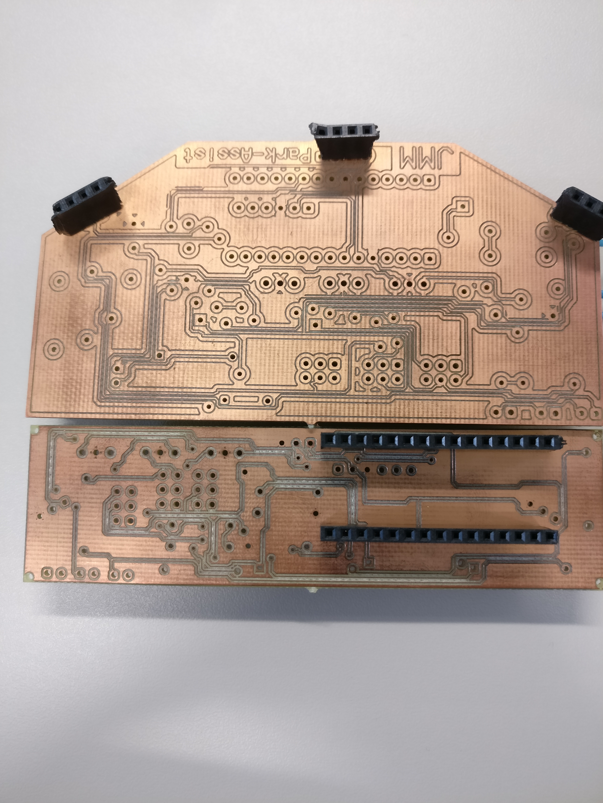
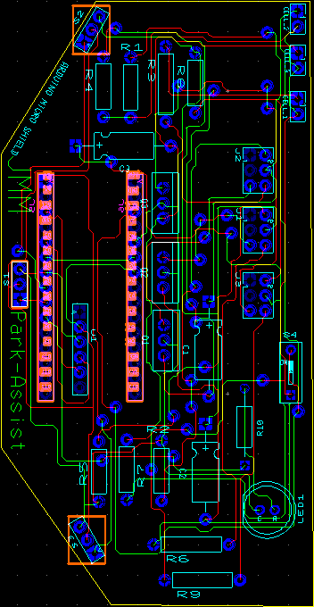
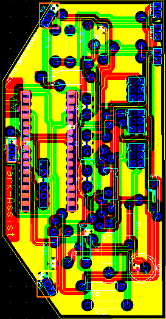
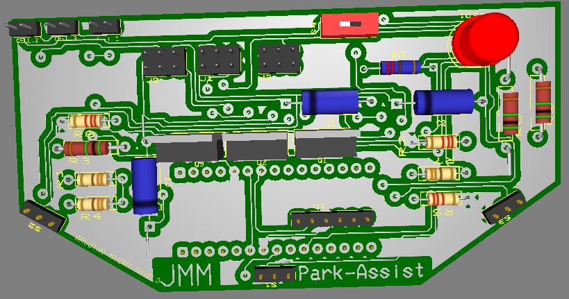
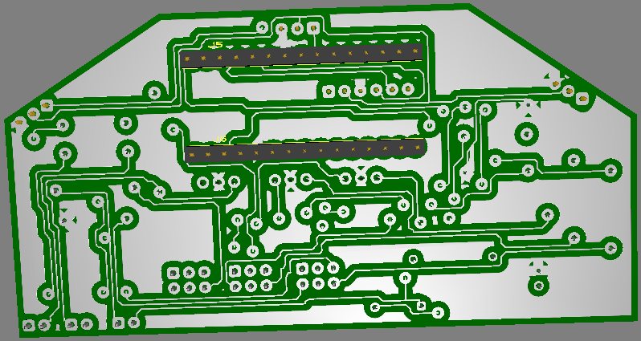

# PCB design
In dit document vind je alle informatie omtrend het PCB design.
Je kunt hier lezen hoe alles tot stand is gekomen en wat je nodig hebt om dit zelf te maken.
<!-- START doctoc generated TOC please keep comment here to allow auto update -->
<!-- DON'T EDIT THIS SECTION, INSTEAD RE-RUN doctoc TO UPDATE -->

- [Beschrijving PCB design](#beschrijving-pcb-design)
  - [doel van het PCB design](#doel-van-het-pcb-design)
  - [De werking en staat van het blok](#de-werking-en-staat-van-het-blok)
  - [Waarom gekozen voor deze oplossing](#waarom-gekozen-voor-deze-oplossing)
  - [Mogelijke alternatieven](#mogelijke-alternatieven)
  - [reflectie resultaat](#reflectie-resultaat)
  - [Installatie handleiding PCB design](#installatie-handleiding-pcb-design)
  - [Gebruikers handleiding PCB design](#gebruikers-handleiding-pcb-design)
- [Overige images](#overige-images)

<!-- END doctoc generated TOC please keep comment here to allow auto update -->

## Beschrijving PCB design
Onze eerste revisie van het PCB design was vooral gericht op een zo klein mogelijke form factor.
Dit hebben we gedaan aangezien dit gegvraagd was door onze product owner (meneer Overdulve).
Hierom hebben we gekozen om componenten aan weerszijden te plaatsen dit zorgt ervoor dat we zo weinig mogelijk ruimte gebruiken.
Onze eerste design was dan ook een rechthoekig blok met het kleinst mogelijke form factor voor dat moment.
Uiteraard hebben we wel rekening moeten houden met de sensoren die plek in namen als ook de hoek waarin deze zouden moeten staan.
Hieronder is ons eerste design te zien (het onderste pcb is de 1e revisie):

Echter zaten hier nog wat kleine foutjes in als ook waren de pads om te solderen veel te klein.
Hierdoor werd het haast onmogelijk om dit goed te solderen zonder dat dit op de power plane kwam.

Hierom zijn we dan ook begonnen aan een 2e revisie van het PCB design. Deze zou ervoor moeten zorgen voor het makkelijker te solderen door grotere pads en meer spacing tussen de powerplane en de pads. Ook werd in deze versie rekening gehouden met het case design. De case heeft namelijk afgezaagde hoeken dit zou dan ook terug moeten komen in het PCB design. Als ook het toevoegen van extra componenten werd in deze revisie gedaan.
De componenten die zijn toegevoegd:
 - Led voor status weergave
 - power switch voor het makkelijker aan en uitzetten van de Arduino

Zoals je op het plaatje ziet is het bovenste design de tweede revisie.

### doel van het PCB design
Het PCB design wordt gebruikt om alle componenten te waarborgen in een zo klein mogelijke form factor voor de parkeer sensor. Alle componenten worden doormiddel van headers op het PCB geplaatst en connecteren hierdoor met de Arduino.
Door alles op een PCB te zetten in plaats van een Matrix bord of Breadbord krijgen we een netter afgewerkt product. Als ook veel meer betrouwbaarheid aangezien er geen verbindingen gemakkelijk opeens verbroken kunnen worden.

### De werking en staat van het blok
Helaas tijdens het printen van dit PCB  is de PCB printer stuk gegaan. Hierdoor is ons PCB niet volledig afgeraakt en hebben we het dus ook niet kunnen testen. We hebben echter wel nog het PCB gebruikt als placeholder voor de sensoren aangezien deze in afgemeten hoeken moesten staan die wel aanwezig waren op het PCB, maar niet op het Matrix bordje.
Het PCB zou werken als een goeie/stabiele manier van het verbinden van de componenten als ook ervoor zorgen dat het product een zo klein mogelijk form factor kon hebben.

### Waarom gekozen voor deze oplossing
We hebben mede voor deze oplossing gekozen omdat het een van de vereisten was van de opdracht. Het was namelijk verplicht om een PCB te maken gebasseerd op het product. Echter als dit niet het geval was geweest hadden we als nog gekozen om een PCB te laten afdrukken. De reden hiervoor is omdat het relatief gemakkelijk is om goed in te schatten hoe je eindproduct eruit gaat zien. Je weet waar alle componenten staan en je kan makkelijk experimenten (doormiddel van simulatie) waar alle componenten/banen moeten komen. Met een Matrix bord vind ik dat persoonlijk een stuk minder omdat je zelf ook nog de draadjes moet leggen en het niet zo makkelijk/mooi is om ze onder elkaar door te laten gaan.
Tevens bied het PCB ook een veel betrouwbare manier van connecties van alle componenten.

### Mogelijke alternatieven
Zoals hierboven al een paar keer gerefeeerd waren onze alternatieven een Breadbord of een Matrix bordje.
We hebben niet voor deze 2 gekozen omdat de verbindingen van deze beide niet zo betrouwbaar zijn als een PCB design.
Als ook de formfactor van deze alternatieven is een stuk moeilijker aan te passen of in te schatten. Zeker bij een Breadbord heb je hier weinig keuze in omdat deze al in bepaalde grootes komen.
Deze methodes zijn dan ook vooral bedoeld om protypes te maken en wij toch echt richten op een finaal product te maken.
Helaas hebben wij door de kapotte PCB machine toch moeten hergrijpen naar het Matrix bord. Hiervoor hebben we wel deels het PCB herbruikt.
Hieronder 2 foto's van hoe het er nu uitziet:

Bovenkant:

Onderkant:

### reflectie resultaat
Persoonlijk ben ik zeer tevreden over het resultaat het PCB ziet er heel goed uit zeker met de hoeken.
Dit geeft toch een goeie touch dan simpel een vierkant PCB. Uiteraard met wat meer meten en testen hadden we het PCB design misschien nog een stuk kleiner kunnen maken, maar we mogen zeker niet klagen over de grote.
Wat echter jammer is (maar niks aan gedaan kan worden) is dat het PCB machine stuk is gegaan. Hierdoor weten we niet zeker of het PCB ook echt goed zou werken of dat er nog kleine foutjes in het design zitten.

### Installatie handleiding PCB design
Voor dat het PCB in gebruik kan worden genomen zullen de nodige componenten en headers op het PCB gesoldeerd moeten worden.
Voor de prijzen en dergelijke van de componenten verwijs ik u door naar de [Bill of materials](../Bill of materials.md).
Alle componenten zullen gesoldeerd moeten worden zoals onderstaand PCB schema (dit is het schema zonder power plate).

De enigste 2 componenten die aan de onderkant moeten geplaatst worden zijn de headers voor de Arduino Nano. Dit omdat het anders veel plek in zou nemen.

Plaats de componenten in de juiste headers (Arduino Nano,BT device, Batterijen, etc) en zorg ervoor dat alles goed is aangesloten voor naar de gebruikers handleiding te gaan.

### Gebruikers handleiding PCB design
Vanaf het moment dat de batterijen en alle componenten goed zijn aangesloten is het tijd om het PCB in gebruik te nemen.
Schakel de schakelaar om zodat er stroom naar de Arduino gaat. Na enkele seconden zal de schakeling klaar zijn om in gebruik genomen te worden.
De sensoren beginnen automatisch met detecteren en zullen automatisch proberen hun data te versturen.
Voor het koppelen van de applicatie met de schakeling verwijs ik u door naar de handleiding van de [Park assist](parkeersensor.md)

## Overige images
Hieronder worden nog wat images van het PCB design.
Het PCB design met power plane:

De 3d weergaves van het PCB (de componenten die worden getoond zijn niet dezelfde als in finale versie)
Bovenaanzicht:

Onderaanzicht:

